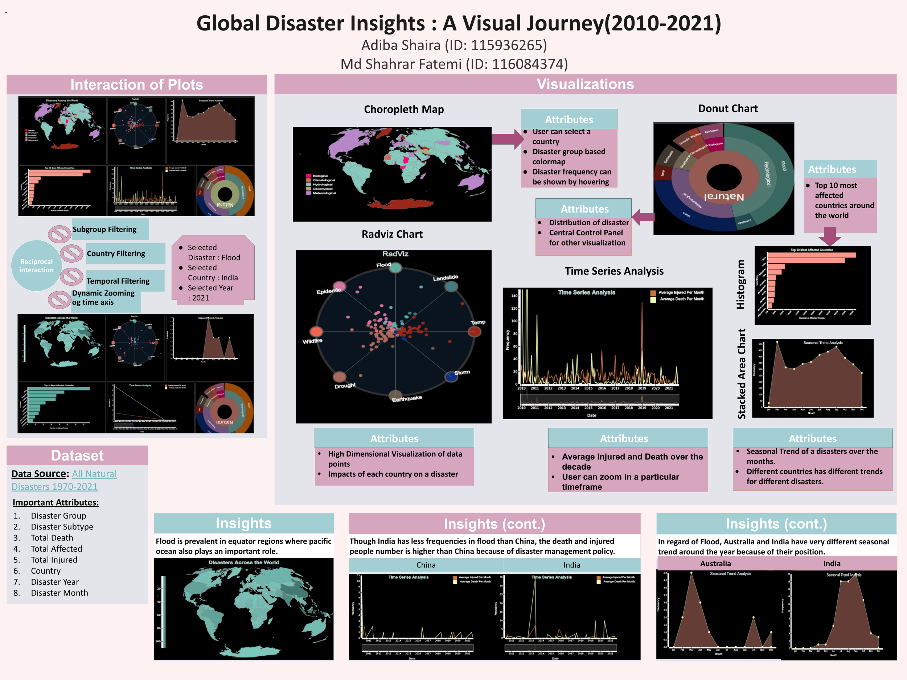

🌍 Global Disaster Insights (2010–2021)

This project presents an interactive visual exploration of global natural disasters from 2010–2021, based on the International Disaster Database (EM-DAT).
It highlights spatio-temporal patterns, affected regions, disaster frequency, casualties, and seasonal trends across countries and disaster types.

🎯 Objective

To visually analyze worldwide disaster trends and uncover patterns related to:

Frequency & intensity of natural disasters

Geo-regional vulnerability

Seasonal trends & human impact

Country-wise disaster distribution & preparedness insights

📊 Key Visualizations
Visualization	Purpose
Choropleth Map	View disaster-affected countries & frequency
Radviz Plot	Compare countries based on contribution to disaster types
Stacked Area Chart	Observe seasonal patterns across regions
Time-Series Chart	Track injured & death counts across years
Donut Chart	Breakdown of disaster categories and sub-groups
Histograms / Bar Charts	Top affected countries & impact severity

🔗 Plots are interconnected with filtering options (country, year, disaster type)

🧠 Insights (Short Summary)

Floods highly affect equatorial & monsoon belt regions (India, Bangladesh, China).

Australia shows unique seasonal flood behavior compared to Asia.

China reports more disasters but fewer casualties due to stronger policies & preparedness.

Storm frequency in India increases over time — likely influenced by climate change.

Climatological disasters (drought & wildfire) spread to new regions in recent years.

Global preparedness has improved, reducing deaths despite high disaster frequency.

🗂️ Dataset

Source: EM-DAT International Disaster Database

Years Used: 2010–2021

Attributes: Country, disaster group/sub-group, date, affected population, injured, dead, etc.

🛠️ Technologies Used

D3.js / JavaScript

React 

Data preprocessing & cleaning (Python / Excel)
## Project Poster

👥 Contributors

Adiba Shaira

Md Shahrar Fatemi
